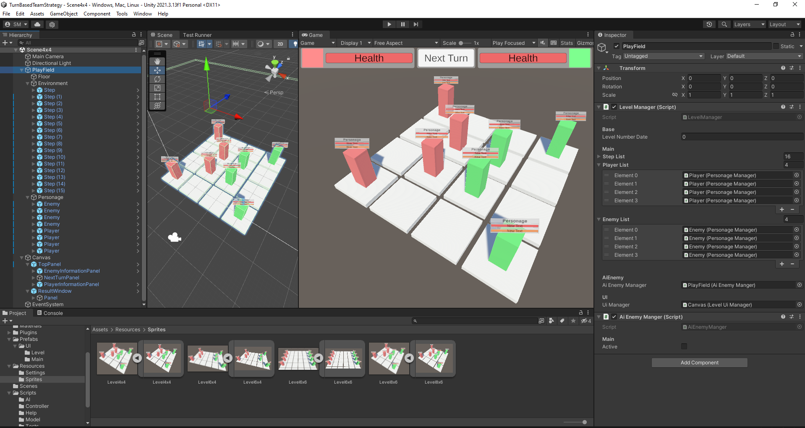

# TurnBasedTeamStrategy
Turn based team strategy 3D

## Task:
1) Create a simple turn-based game with party-based mechanics and choice battle locations.
2) The battle should take place N on M characters.
3) The combat mechanics themselves can be arbitrary, to your taste.
4) 2d or 3d - there is no difference and in general the graphics are not important (although cubes).
5) configuration parameters must be in Json.
6) At least two screens: location selection and the battle itself.
7) In battle there is at least one Next Turn button.
8) Display logic separately, business logic separately.
9) Minimal UI.

## Implemented:
All

+:
1) Business logic tests.
2) Simple animations are made using DOTween.
3) Simple logic of artificial intelligence.

## Unity 2021.3.13

